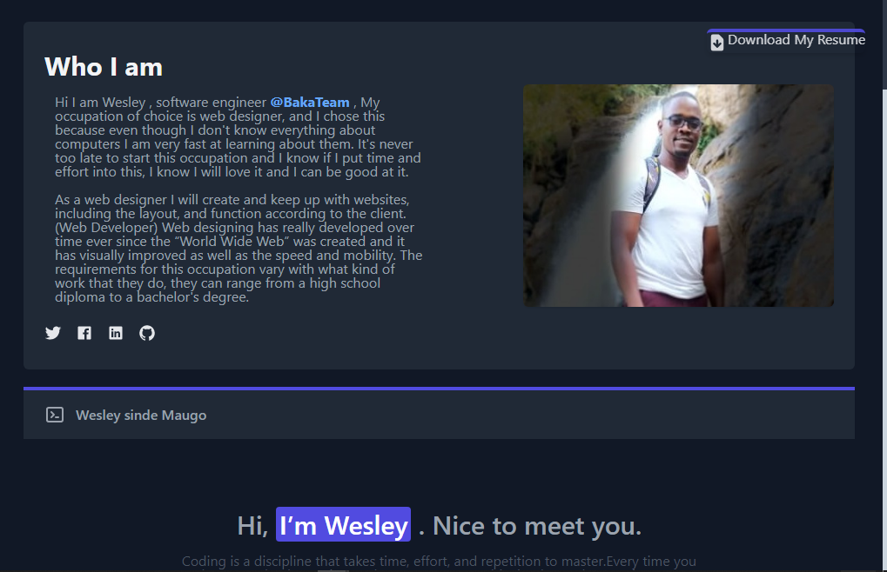

# laravel-portfolio-site

A portfolio template website app created in Laravel.

## Purpose

This is one of my favorite laravel and tailwind css portfolio templates since it stands out right away. Why go through the trouble of starting from the beginning if you don't have to?
With a ready-to-use site canvas, you'll get the same fantastic results!
And this is a great example of it.
You may first see a live demo, which will give you a better idea of how amazing it is. That's incredible!
The parallax effect, on scroll content loading, back to top button, and animated statistics are just a few of the things you'll enjoy. This is only a small sample of the many delights that make Glint so unique.
Laravel and would be a great project for me to show what I've learned. This is the alpha version and only the prayer request program. I will be refactoring and updating as time goes on. This is open
source and you may clone it and modify to your heart's content

## Technologies used

1. Laravel 5.8
2. JavaScript
3. CSS SASS
4. tailwind css
5. PHP 7+
6. MySql

## Requirements to Run

1. PHP 7+
2. Composer
3. node.js (npm) for installing dependies
4. git

## Instructions to install

1. Make sure PHP 7+ and Mysql is installed and running. I recommend Xampp for windows users.
2. Create an empty mysql database and note the name, username, and password.
3. Make sure git is installed.
4. At a command prompt, type "git clone https://github.com/rcol4jc/laravel-portfolio-site.git". This will create a laravel-portfolio-site folder in your current directory.
5. Cd into that directory.
6. Run 'composer install'
7. Run 'npm install'
8. copy .env.example file to .env
9. Type 'php artisan key:generate'
10. Type 'php artisan storage:link' to add public storage access.
11. Edit the .env (not .env.example) and under the mysql settings, put in your database name, username, and password from step 2.
12. Type 'php artisan migrate' to set up the tables in the database.
13. Type 'php artisan db:seed' to seed the libraries, languages, frameworks, databases, and skills tables.
14. Type 'php artisan serve' to start the development server. Browse to http://localhost:8000/

## Demo live

My portfolio site is running on this application. Check it out at:

https://www.wesley.io.ke/portfolio

Check it out

<a href="https://www.wesley.io.ke/portfolio" target="_blank">Check it out at:</a>

